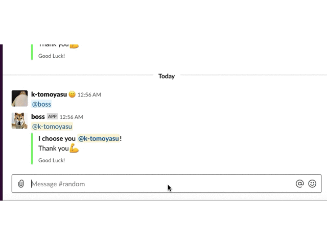

# taskuji-slackbot-event-subscribe
Mention to bot, bot choose user randomly in the channel.  
Typical usage is when asking someone for a task.  

Implementatin is based on [go-slack-interactive](https://github.com/tcnksm/go-slack-interactive).

## Usage in Slack
Mention bot user name then bot nominate a member in the channel randomly.
Press `OK` button if the member can do the task, otherwise press `NG` buttton.
When `NG` button is pressed, bot nominate a member randomly again.


## Preparation in Slack
-  [Create Slack App as internal integrations](https://api.slack.com/internal-integrations)
-  Turn on `Bots`
-  Turn on `Interactivity` and set `Request URL` : `{scheme}://{host}/interaction` 
-  Turn on `Event Subscriptions`
    - Set `Request URL` : `{scheme}://{host}/event` 
    - Add `Subscribe to bot events` : `app_mention` 
-  Add Permissions
    - channels:read
    - chat:write
    - groups:read
    - incoming-webhook
-  Invite bot user to your channel.

## Run
To run this bot, you need to set the following env vars,

```bash
export BOT_TOKEN="xoxb-***"      // you can get this after create a bot user (via slack app management console)
export VERIFICATION_TOKEN="***"  // you can get this after enable interactive message (via slack app management console)
export SIGNING_SECRET="***"  // you can get this after enable interactive message (via slack app management console)
```

To run this, 

```bash
$ dep ensure
$ go build -o bot && ./bot
```
